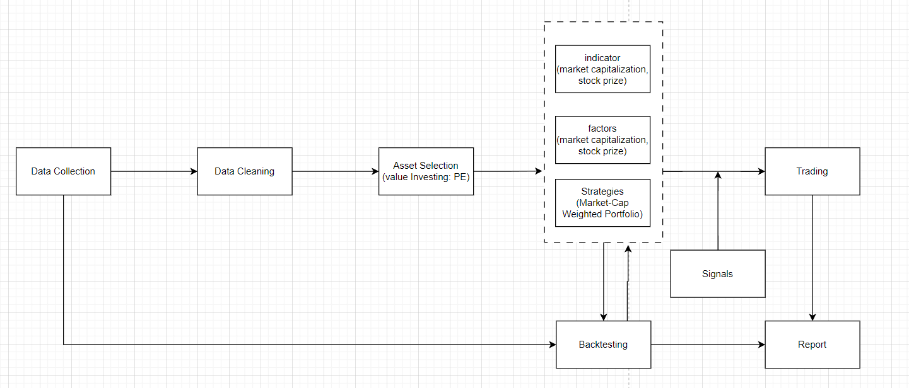

# Quantitative Trading System MVP Outline

## 1. Introduction

### 1.1. Purpose
- Briefly explain the purpose of this document, which is to outline the MVP of the quantitative trading system.

### 1.2. Scope
- Define the scope of the MVP, including the key features and functionalities to be included.

#### 1.2.1 Detailed Functional Requirements
- Fetch Module
  - Periodically (daily/hourly/etc) fetch specified stocks data and company's securities info.
  - Provide 

## 2. Data Collection and Preprocessing Module

### 2.1. Data Collection
Explain how data will be collected from the chosen data sources, including data provider selection and data format.
- Describe the data sources to be used, including market data feeds, historical data, and economic indicators.
- Specify method to fetch from data source.
- Specify data format that will be stored in database.
- Specify the data update frequency (daily/hourly/etc).
- Data storage schema will be confirmed.
- Automation update.

| **用户故事或用例 1：获取历史价格数据** |                                |
|--------------------------------------|--------------------------------|
| **描述**                             | 作为量化交易系统的用户，我希望能够使用数据抓取模块来获取历史价格数据，以便执行技术分析和策略回测。 |
| **输入**                             | 用户指定交易对、时间范围和频率。              |
| **处理**                             | 数据抓取模块将通过合适的数据提供商（例如，交易所API或第三方数据源）检索历史价格数据。 |
| **输出**                             | 模块将返回时间序列数据，包括时间戳、开盘价、最高价、最低价、收盘价和交易量。     |

| **用户故事或用例 2：实时市场数据订阅** |                               |
|--------------------------------------|--------------------------------|
| **描述**                             | 作为量化交易系统的用户，我希望能够使用数据抓取模块来订阅和接收实时市场数据，以进行实时交易。 |
| **输入**                             | 用户指定要订阅的交易对和数据频率。              |
| **处理**                             | 模块将与实时数据提供商建立连接，并定期接收和处理数据更新。     |
| **输出**                             | 实时数据以时间戳的形式传递给其他模块，以供交易决策使用。       |

### 2.3. Data Cleansing
Discuss the methods for cleaning and preprocessing raw data to ensure data quality.

- Process the missing data.
- Process the exception data.
- Format data to desire format.
- Remove repeat data.

| **用户故事或用例 1：处理缺失数据** |                                |
|------------------------------------|--------------------------------|
| **描述**                           | 作为数据清洗模块的用户，我希望能够处理原始数据中的缺失数据，以确保数据质量。 |
| **输入**                           | 原始数据集包含缺失数据的记录或字段。               |
| **处理**                           | 数据清洗模块将采用适当的方法（例如填充、删除或插值）来处理缺失数据。 |
| **输出**                           | 清洗后的数据集，不再包含缺失数据。                  |

| **用户故事或用例 2：处理异常数据** |                                |
|------------------------------------|--------------------------------|
| **描述**                           | 作为数据清洗模块的用户，我希望能够处理原始数据中的异常数据，如离群值或错误记录，以确保数据质量。 |
| **输入**                           | 原始数据集包含异常数据的记录。                 |
| **处理**                           | 数据清洗模块将识别和处理异常数据，可以通过修复、删除或标记等方式。 |
| **输出**                           | 清洗后的数据集，不再包含异常数据。                 |

| **用户故事或用例 3：格式化数据到所需格式** |                            |
|--------------------------------------------|----------------------------|
| **描述**                                   | 作为数据清洗模块的用户，我希望能够将原始数据转换为所需的数据格式，以便后续分析和应用。 |
| **输入**                                   | 原始数据可能以不同的格式或结构存在。             |
| **处理**                                   | 数据清洗模块将执行数据格式化、重组或变换操作，以满足所需的数据格式。 |
| **输出**                                   | 格式化后的数据集，符合所需的数据格式和结构。        |

| **用户故事或用例 4：去除重复数据** |                            |
|-----------------------------------|----------------------------|
| **描述**                          | 作为数据清洗模块的用户，我希望能够识别和移除原始数据中的重复记录，以确保数据质量。 |
| **输入**                          | 原始数据集可能包含重复记录。                  |
| **处理**                          | 数据清洗模块将识别和去除重复记录，以减少数据冗余。 |
| **输出**                          | 清洗后的数据集，不再包含重复记录。             |

### 2.4. Data Storage
- Specify the data storage solution to be used and how collected data will be stored efficiently.

## 3. Strategy Module

### 3.1. Strategy Definition
Define the trading strategy to be implemented in the MVP, including the entry and exit conditions. 
- Define the fundamental entry and exit conditions for your strategy. This can be simple technical indicator crossover signals, such as moving average crossovers, or fundamental conditions like yield or valuation metrics.
- Specify the assets or securities to be traded in the MVP stage. This can be a limited asset portfolio to simplify development and testing.
- Define the most basic risk management rules, such as maximum loss tolerance or capital allocation rules.
- Develop a simple signal generation logic to determine when to execute buy or sell actions.
- Define the most basic trading rules, such as market orders or limit orders and when to execute trades.

| **用户故事或用例 1：定义交易策略入场条件** |                                               |
|--------------------------------------------|-----------------------------------------------|
| **描述**                                   | 作为交易策略的制定者，我希望能够明确定义MVP阶段的入场条件，以指导交易决策。 |
| **输入**                                   | 入场条件，如技术指标交叉信号或基本面条件。               |
| **处理**                                   | 制定和明确定义交易策略的入场条件，包括指标、阈值和时间窗口。 |
| **输出**                                   | 入场条件的规范描述，用于后续交易决策的参考。               |

| **用户故事或用例 2：定义交易策略出场条件** |                                               |
|--------------------------------------------|-----------------------------------------------|
| **描述**                                   | 作为交易策略的制定者，我希望能够明确定义MVP阶段的出场条件，以指导交易决策。 |
| **输入**                                   | 出场条件，如技术指标交叉信号或基本面条件。               |
| **处理**                                   | 制定和明确定义交易策略的出场条件，包括指标、阈值和时间窗口。 |
| **输出**                                   | 出场条件的规范描述，用于后续交易决策的参考。               |

| **用户故事或用例 3：指定交易资产或证券** |                               |
|------------------------------------------|-------------------------------|
| **描述**                                 | 作为交易策略的制定者，我希望能够明确定义MVP阶段要交易的资产或证券，以简化开发和测试。 |
| **输入**                                 | 所选的资产或证券，可以是一组有限的投资组合。             |
| **处理**                                 | 确定要在MVP阶段交易的资产或证券，以限定策略的范围。     |
| **输出**                                 | 指定的交易资产或证券列表，用于交易决策和模拟交易。         |

### 3.2. Indicator Selection
List the technical indicators or methods that will be used for signal generation (e.g., moving averages, RSI).
- Choose the most fundamental technical indicators that will be used to generate initial trading signals. This may include moving averages, Relative Strength Index (RSI), and others.
- Determine the parameter settings for the selected indicators to suit your strategy's requirements. This may involve setting parameters such as the length of moving averages or threshold values for RSI.

| **开发Indicator用户故事 1：选择价格数据** |                                           |
|--------------------------------------------|-------------------------------------------|
| **描述**                                   | 作为策略开发者，我希望能够选择适用于均值回归策略的价格数据，以用于Indicator的计算。 |
| **输入**                                   | 可用的价格数据，如开盘价、收盘价、高低价等。            |
| **处理**                                   | 选择适当的价格数据，以满足均值回归策略的需求。         |
| **输出**                                   | 选定的价格数据，用于Indicator的计算和策略开发。       |

| **开发Indicator用户故事 2：定义均值回归参数** |                                             |
|------------------------------------------------|---------------------------------------------|
| **描述**                                       | 作为策略开发者，我希望能够定义均值回归Indicator所需的参数，以确保正确的计算。 |
| **输入**                                       | 均值回归参数，如均值期间、阈值等。              |
| **处理**                                       | 制定和明确定义均值回归Indicator的参数设置，以满足策略要求。 |
| **输出**                                       | 均值回归Indicator参数的规范描述，用于Indicator的计算。     |

| **开发Indicator用户故事 3：计算均值回归Indicator** |                                         |
|------------------------------------------------------|-----------------------------------------|
| **描述**                                             | 作为策略开发者，我希望能够计算均值回归Indicator，以用于策略的信号生成。 |
| **输入**                                             | 选定的价格数据和均值回归参数。           |
| **处理**                                             | 开发Indicator的计算方法，包括价格数据的处理和均值计算。 |
| **输出**                                             | 均值回归Indicator的规范描述，用于策略的信号生成和回测。   |

### 3.3. Factors

| **开发Factors用户故事 1：选择因子数据** |                                             |
|-----------------------------------------|---------------------------------------------|
| **描述**                                | 作为策略开发者，我希望能够选择适用于均值回归策略的因子数据，以用于因子的计算。 |
| **输入**                                | 可用的因子数据，如财务指标、技术指标、宏观经济数据等。 |
| **处理**                                | 选择适当的因子数据，以满足均值回归策略的需求。        |
| **输出**                                | 选定的因子数据，用于因子的计算和策略开发。          |

| **开发Factors用户故事 2：定义均值回归参数** |                                           |
|--------------------------------------------|-------------------------------------------|
| **描述**                                   | 作为策略开发者，我希望能够定义均值回归Factors所需的参数，以确保正确的计算。 |
| **输入**                                   | 均值回归Factors参数，如均值期间、阈值等。  |
| **处理**                                   | 制定和明确定义均值回归Factors的参数设置，以满足策略要求。 |
| **输出**                                   | 均值回归Factors参数的规范描述，用于Factors的计算。    |

| **开发Factors用户故事 3：计算均值回归Factors** |                                      |
|------------------------------------------------|--------------------------------------|
| **描述**                                       | 作为策略开发者，我希望能够计算均值回归Factors，以用于策略的信号生成。 |
| **输入**                                       | 选定的因子数据和均值回归参数。          |
| **处理**                                       | 开发Factors的计算方法，包括因子数据的处理和均值计算。 |
| **输出**                                       | 均值回归Factors的规范描述，用于策略的信号生成和回测。   |

### 3.4. Risk Management
- Explain how risk management rules, such as position sizing, stop-loss, and take-profit, will be integrated into the signal generation process.

### 3.5. Asset Selection 
| **Asset Selection 用户故事 1：定义资产池** |                                             |
|--------------------------------------------|---------------------------------------------|
| **描述**                                   | 作为策略开发者，我希望能够明确定义策略的资产池，以指导均值回归策略的资产选择。 |
| **输入**                                   | 可用的资产列表，如股票、债券、商品等。        |
| **处理**                                   | 制定和明确定义资产池，包括资产的选择和筛选规则。   |
| **输出**                                   | 资产池的规范描述，用于实际资产选择和策略开发。   |

| **Asset Selection 用户故事 2：根据均值回归因子选择资产** |                                 |
|------------------------------------------------------------|---------------------------------|
| **描述**                                                   | 作为策略开发者，我希望能够根据均值回归因子的信号，选择符合策略的资产。 |
| **输入**                                                   | 均值回归因子的计算结果和策略要求。        |
| **处理**                                                   | 根据均值回归因子的信号和策略要求，选择适合的资产。 |
| **输出**                                                   | 选定的资产列表，用于策略的实际执行和回测。   |

### 3.5. Backtesting
- Briefly outline the backtesting module that will be used to evaluate the historical performance of the strategy.

| **用户故事或用例 1：执行回测** |                                                |
|----------------------------------|-----------------------------------------------|
| **描述**                         | 作为交易策略的开发者，我希望能够执行回测，以评估策略的性能和有效性。 |
| **输入**                         | 选定的交易策略、历史价格数据、初始资本和回测时间范围。   |
| **处理**                         | 执行回测，根据策略规则在历史数据上模拟交易，并记录交易决策和资本变化。 |
| **输出**                         | 回测报告，包括策略的绩效指标、回测期间的交易记录和资本曲线。     |

| **用户故事或用例 2：评估回测结果** |                                                |
|----------------------------------|-----------------------------------------------|
| **描述**                         | 作为交易策略的开发者，我希望能够评估回测结果，以确定策略的盈利潜力和风险。 |
| **输入**                         | 回测报告和绩效指标，如收益率、最大回撤、胜率等。           |
| **处理**                         | 分析回测结果，评估策略的盈亏和风险，以决定是否进行策略的优化或实际交易。 |
| **输出**                         | 评估报告，包括关于策略潜在改进的建议和交易决策的合理性。        |

## 4. Portfolio Construction Module

### 4.1. Asset Selection
- Discuss how assets will be selected for trading based on the generated signals and risk preferences.

| **用户故事或用例 1：定义投资组合构建规则** |                                                |
|----------------------------------------------|-----------------------------------------------|
| **描述**                                     | 作为投资组合构建模块的用户，我希望能够明确定义投资组合构建规则，以指导资产的分配和配置。 |
| **输入**                                     | 投资组合构建规则，如权重分配、资产约束或多样化要求。      |
| **处理**                                     | 制定和明确定义投资组合构建规则，包括资产的选择和分布。    |
| **输出**                                     | 投资组合构建规则的规范描述，用于实际投资组合构建。        |

| **用户故事或用例 2：选择可供选择的资产** |                                                |
|----------------------------------------------|-----------------------------------------------|
| **描述**                                     | 作为投资组合构建模块的用户，我希望能够从可供选择的资产中选择适合投资组合的资产。 |
| **输入**                                     | 可供选择的资产列表，如股票、债券、商品等。              |
| **处理**                                     | 从可供选择的资产列表中选择适用于投资组合的资产。        |
| **输出**                                     | 选定的资产列表，用于投资组合的构建和分配。                |

| **用户故事或用例 3：构建投资组合** |                                                |
|--------------------------------------|-----------------------------------------------|
| **描述**                             | 作为投资组合构建模块的用户，我希望能够根据定义的规则和选定的资产构建投资组合。 |
| **输入**                             | 投资组合构建规则和选定的资产列表。                    |
| **处理**                             | 根据规则分配资产，构建投资组合，确定资产权重和配置。    |
| **输出**                             | 构建完成的投资组合，包括资产分配和配置的详细信息。        |

### 4.2. Position Sizing
- Describe how the MVP will determine the size of positions to be taken for each trade.

## 5. Execution Module

### 5.1. Order Execution
- Explain how orders will be executed, including the choice of a trading platform or brokerage.

### 5.2. Algorithmic Execution
- Mention any algorithms or methods that will be used for efficient order execution.

## 6. Reporting and Analytics Module

### 6.1. Reporting Tools
- List the tools or components that will be used for generating reports on trading performance.

### 6.2. Performance Metrics
- Specify the performance metrics that will be calculated, such as the Sharpe ratio and drawdown.

## 7. User Interface (UI) Module

### 7.1. Basic UI
- Outline the basic user interface for interacting with the MVP, including dashboard elements and data visualization.

## 8. Conclusion

### 8.1. Summary
- Summarize the key components of the MVP and the overall objectives of the quantitative trading system.

### 8.2. Next Steps
- Mention what will follow after the MVP, including further development, testing, and deployment.
